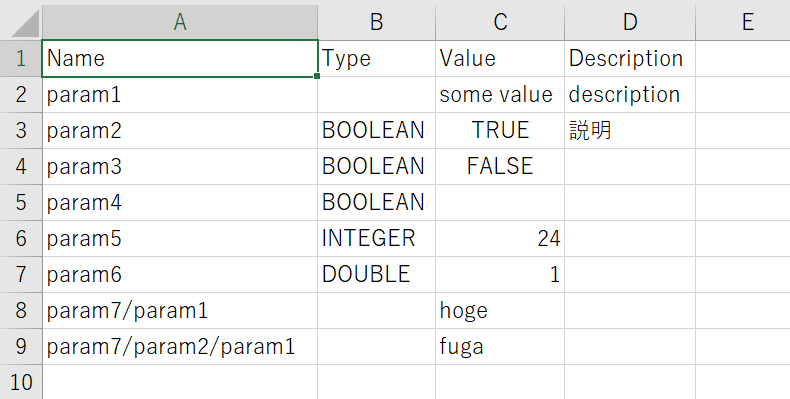

# ffptutils-py
a python library that reads/writes Spirent iTest Parameter (.ffpt) files

## Features

- Convert .ffpt file <-> .csv file.
  - Supported CSV encoding is utf-8 with BOM (Suitable for Windows Excel).
  - Supported Parameter Types are: TEXT, BOOLEAN, INTEGER and DOUBLE.
- Load .ffpt file from your python script.

## Usage 1) Convert .ffpt <-> .csv

1) Convert a ffpt file to csv format. 

```
> python ffpt2csv.py file1_orig.ffpt edit.csv
```

2) Edit the csv file using Excel or other software.


3) Convert the csv file back to ffpt format.
```
> python csv2ffpt.py edit.csv file1.ffpt
```

## Usage 2) General purpose .ffpt file loader

```python
import ffptutils
pt = ffptutils.load('test/2.ffpt')

assert pt['param1'] == 'some value'
assert pt['param2'] == True
assert pt['param3'] == False
assert pt['param4'] == None
assert pt['param5'] == 24
assert pt['param6'] == 1.0
assert pt['param7/param1'] == 'hoge'
assert pt['param7/param2/param1'] == 'fuga'
```

As you can see, it recognizes the Parameter types and converts into the appropriate python types as below:

- TEXT -> str
- DOUBLE -> float
- INTEGER -> int
- BOOLEAN -> bool

## TODO: Planned features

- pip packaging
